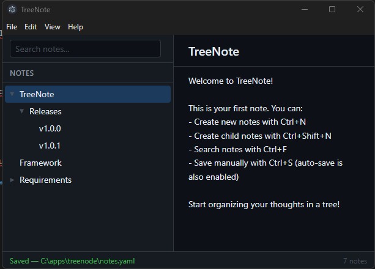

# TreeNote

TreeNote is an Electron-based desktop notes app that organizes notes in a parent-child tree.



## Features

- Hierarchical notes (create, rename, delete, reorder, move by drag-and-drop)
- Split layout: tree, editor, and search views
- Search by note title and content (case-insensitive)
- Keyboard shortcuts and menu actions for common workflows
- YAML-based persistence with auto-save and manual save
- Cross-platform packaging targets (Windows, macOS, Linux)

## Installation

Download the latest TreeNote-Setup installer for your platform from the
[GitHub Releases](https://github.com/musuk/treenote/releases/latest) page.

No additional runtime or dependencies required — TreeNote is a self-contained executable.

## Development

### Tech Stack

- Electron + electron-vite
- TypeScript
- Vitest for unit tests
- ESLint + Prettier
- `js-yaml` for persistence

### Prerequisites

- Node.js 20+
- npm

### Install dependencies

```bash
npm ci
```

### Run in Development

```bash
npm run dev
```

Run with a specific notes file:

```bash
npm run dev -- -- /path/to/notes.yaml
```

Supported startup argument formats:

- positional path: `/path/to/notes.yaml`
- `--file /path/to/notes.yaml`
- `--file=/path/to/notes.yaml`
- `-f /path/to/notes.yaml`

If the file does not exist, TreeNote creates it automatically.

## Build

### App build (no installer packaging)

```bash
npm run build
```

### Cross-platform package (from package scripts)

```bash
npm run package
```

### Windows package

```bash
npm run package:win
```

### Windows package to directory output

```bash
npm run package:dir
```

## Build Scripts in Repo

These scripts install dependencies and build from scratch:

- `build.sh` – generic build (`npm ci` + `npm run build`)
- `build-win.sh` – Windows installer + portable packaging via `electron-builder`
- `build-win.bat` – Windows batch equivalent of `build-win.sh`; outputs to `dist/`

## Local macOS Brew Release

Use the local release script to build and publish a DMG release, then update the Homebrew tap cask
in a sibling `homebrew-treenote` repository:

```bash
./release-mac.sh 1.0.3
```

The script performs the following:

- validates GitHub CLI authentication and repository cleanliness
- updates `package.json` version locally and commits release version files
- runs `npm ci` and `npm run build`
- packages macOS DMG via `electron-builder`
- normalizes DMG file name to `TreeNote-<version>.dmg`
- calculates SHA256 checksum
- creates GitHub release `v<version>` and uploads the DMG
- creates/syncs local git tag after release publication
- updates and pushes `../homebrew-treenote/Casks/treenote.rb`

Optional second argument:

- release notes file path (default: `RELEASE_NOTES.md`)

Optional environment variables:

- `TAP_REPO_PATH` (default: `../homebrew-treenote`)
- `SOURCE_REPO` (default: auto-detected from git remote)
- `TAP_BRANCH` (default: `main`)

The script is designed to execute the full release flow from local machine without GitHub Actions.

## Test, Lint, Typecheck

```bash
npm run test
npm run lint
npm run typecheck
```

Additional scripts:

- `npm run test:watch`
- `npm run test:e2e`
- `npm run lint:fix`

## Data Storage

- Notes are stored in YAML.
- Default file name is `notes.yaml`.
- In portable mode, the default data file is placed next to the executable.

## Keyboard Shortcuts

Core shortcuts available via app menu:

- `Ctrl/Cmd+N` — New Note
- `Ctrl/Cmd+Shift+N` — New Child Note
- `Ctrl/Cmd+S` — Save
- `Ctrl/Cmd+F` — Find
- `Ctrl/Cmd+1` — Focus Tree
- `Ctrl/Cmd+2` — Focus Editor
- `Ctrl/Cmd+3` — Focus Search

## Project Structure

- `src/main` – Electron main process (window, IPC, file handling, menu)
- `src/preload` – secure renderer API bridge
- `src/renderer` – UI, app core, views, styles
- `tests/unit` – unit tests by module area
- `resources` – app icons and packaging resources
- `scripts` – helper scripts for packaging/build customization

## Windows Installation

### Download and install (recommended)

1. Download `TreeNote Setup <version>.exe` from [GitHub Releases](../../releases).
2. Run the installer — it installs per-user (no admin required).
3. The installer adds the TreeNote directory to your **user PATH** automatically.
4. Open a new command prompt and run:
   ```
   treenote
   ```

### Portable (no install)

Download `TreeNote <version>.exe`, place it anywhere, and run it directly.
No PATH changes are made in portable mode.

### Uninstall

Use **Settings → Apps** or **Control Panel → Programs** to uninstall.
The installer removes itself and its installed files cleanly.

## Packaging Targets

Configured in `electron-builder.yml`:

- Windows: NSIS installer + portable
- macOS: dmg
- Linux: AppImage, deb

## License

MIT (see `LICENSE`).
